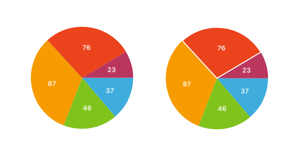

## YTPieChart

A simple and  pieChart lib for iOS



### Requirements

YTPieChart works on iOS 7.0+ and is compatible with ARC projects.

* UIKit

### Features

* customized color for slices
* slice selection animation
* text label option of showing custom text
* supports xib/storyboard

### Installation

#### Manual
Drag the YTPieChart folder into your project.

#### Cocoapods
```
pod 'YTPieChart'
```

### Usage

(smple in /Demo)

```objc
- (void)viewDidLoad {
    [super viewDidLoad];
    // Do any additional setup after loading the view, typically from a nib.
    self.chartView.dataSource = self;
    self.chartView.delegate = self;
    self.chartView.selectSliceLineWidth = 2.0;
    self.chartView.titleColor = [UIColor whiteColor];
    self.chartView.titleFont = [UIFont boldSystemFontOfSize:13];
    [self prepareDataSource];
    [self.chartView reloadData];
}

- (void)prepareDataSource {
    NSArray *values = @[ @"37", @"46", @"87", @"76", @"23" ];
    _values = [NSMutableArray arrayWithArray:values];
    NSArray *colors = @[
        [UIColor colorWithRed:0.2431 green:0.6784 blue:0.8588 alpha:1.0],
        [UIColor colorWithRed:0.5059 green:0.7647 blue:0.1137 alpha:1.0],
        [UIColor colorWithRed:0.9647 green:0.6078 blue:0.0 alpha:1.0],
        [UIColor colorWithRed:0.9216 green:0.2627 blue:0.1098 alpha:1.0],
        [UIColor colorWithRed:0.7333 green:0.2118 blue:0.3686 alpha:1.0]
    ];
    _colors = [NSMutableArray arrayWithArray:colors];
    _titles = [NSMutableArray arrayWithArray:values];
}

#pragma mark - YTPieChartDataSource
- (NSInteger)numberOfSlicesInChart:(YTPieChart *)chart {
    return _values.count;
}

- (CGFloat)chart:(YTPieChart *)chart valueForSliceAtIndex:(NSInteger)index {
    CGFloat value = [_values[index] doubleValue];
    return value;
}

- (UIColor *)chart:(YTPieChart *)chart colorForSliceAtIndex:(NSInteger)index {
    return _colors[index];
}

- (NSString *)chart:(YTPieChart *)chart titleForSliceAtIndex:(NSInteger)index {
    return _titles[index];
}

#pragma mark - YTPieChartDelegate
- (void)chart:(YTPieChart *)chart didSelectSliceAtIndex:(NSInteger)index {
    NSLog(@"select value: %@", _values[index]);
}

- (void)chart:(YTPieChart *)chart didDeselectSliceAtIndex:(NSInteger)index {
    NSLog(@"deselect value: %@", _values[index]);
}
```
